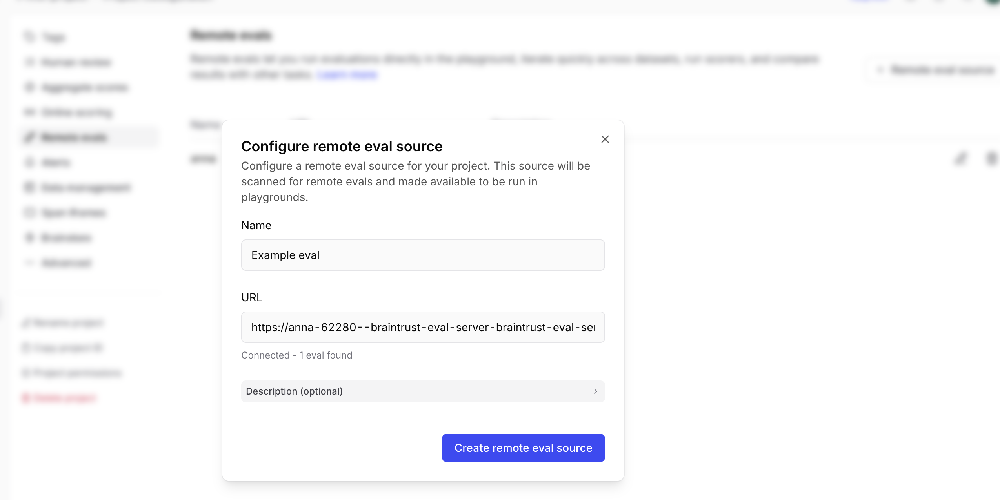
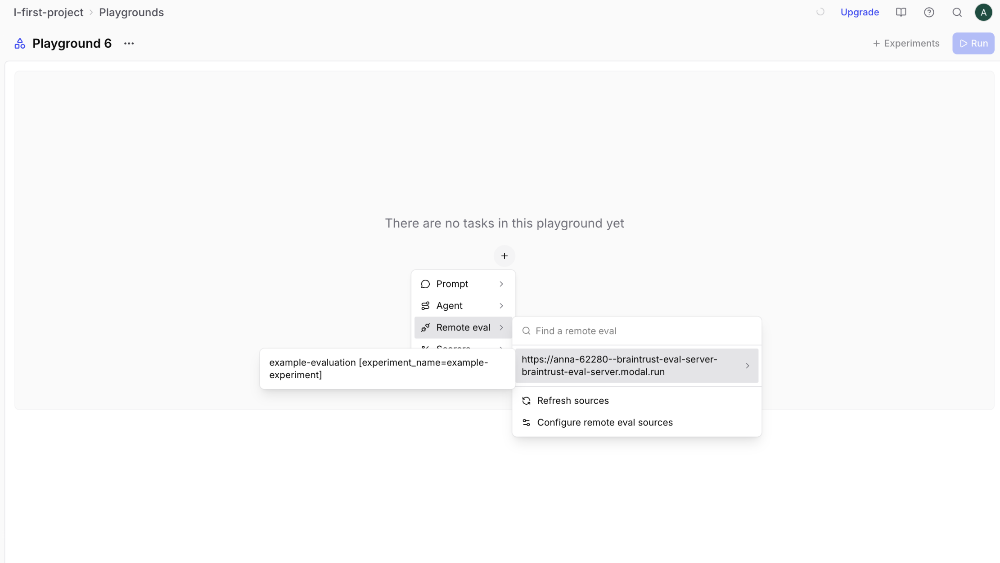

# Remote Evals in Braintrust with Modal

A ready-to-use template for deploying Braintrust evaluations to Modal. This template demonstrates how to set up a remote evaluation server that can be accessed from the Braintrust Playground.

## Quick start

```bash
# Clone the repository
git clone https://github.com/yourusername/braintrust-modal-template
cd braintrust-modal-template

# Install dependencies
uv sync --upgrade

# Activate virtual environment
source .venv/bin/activate

# Set up environment variables
cp .env.example .env
# Edit .env and add your API keys

# Authenticate with Modal
modal token new

# Deploy the evaluation server (development mode with auto-reload)
modal serve src/eval_server.py
```

## What this template includes

- **`src/eval_server.py`**: Modal deployment configuration for Braintrust evaluations
- **`evals/eval_example.py`**: A simple example evaluation file
- **`pyproject.toml`**: Project dependencies and configuration
- **`.env.example`**: Template for environment variables

## Project structure

```text
braintrust-modal-template/
├── evals/
│   ├── __init__.py
│   └── eval_example.py      # Example evaluation file
├── src/
│   └── eval_server.py       # Modal deployment configuration
├── .env.example             # Environment variables template
├── .gitignore
├── pyproject.toml           # Project dependencies
└── README.md
```

## Setup instructions

### 1. Prerequisites

- Python 3.11 or higher
- [uv](https://github.com/astral-sh/uv) package manager (or use `pip` if you prefer)
- Modal account ([sign up here](https://modal.com))
- Braintrust account ([sign up here](https://www.braintrust.dev))

### 2. Install dependencies

Using `uv` (recommended):

```bash
uv sync --upgrade
source .venv/bin/activate
```

Or using `pip`:

```bash
pip install -r requirements.txt
```

### 3. Configure environment variables

Copy the example environment file and add your API keys:

```bash
cp .env.example .env
```

Edit `.env` and add:

```env
OPENAI_API_KEY=your_openai_api_key_here
```

### 4. Authenticate with Modal

```bash
modal token new
```

This will open a browser to authenticate with your Modal account.

### 5. Deploy to Modal

**Development mode** (auto-reloads on changes):

```bash
modal serve src/eval_server.py
```

**Production deployment**:

```bash
modal deploy src/eval_server.py
```

After deployment, Modal will output a URL like:

```text
https://your-username--braintrust-eval-server.modal.run
```

## Using the evaluation server

### Step 1: Configure remote eval source

1. Navigate to Project Configuration > Remote Evals
2. Click the "+ Remote eval sources" button and paste your Modal deployment URL



### Step 2: Add remote eval to playground

1. Open your playground
2. Click the "+" button and choose your configured source from "Remote eval"
3. Add a dataset and run



### From command line

You can also run evaluations locally:

```bash
braintrust eval evals/eval_example.py
```

## Creating your own evaluations

1. Create a new file in `evals/` following the pattern `eval_*.py`
2. Define your evaluation using Braintrust's `Eval()` function
3. The server will automatically discover and load it

Example (`evals/eval_my_eval.py`):

```python
from braintrust import Eval, init_dataset

async def my_task(input, hooks=None):
    # Your task logic here
    return {"output": "result"}

Eval(
    "my-evaluation",
    data=init_dataset("my-dataset"),
    task=my_task,
    scores=[...],
    parameters={...},  # These become configurable in the UI
)
```

See `evals/eval_example.py` for a complete example with parameter handling, including prompt parameters that render as full editors in the Playground.

## Customizing Modal deployment

### Changing the app name

Edit `src/eval_server.py`:

```python
app = modal.App("your-custom-name", image=modal_image)
```

### Adding more dependencies

Edit `pyproject.toml`:

```toml
dependencies = [
    "braintrust~=0.3.6",
    "your-package>=1.0.0",
    # ...
]
```

Then run:

```bash
uv sync --upgrade
```

### Adding source directories

Edit `src/eval_server.py`:

```python
modal_image = (
    modal.Image.debian_slim()
    .uv_sync()
    .add_local_python_source("src")
    .add_local_python_source("evals")
    .add_local_python_source("utils")  # Add more as needed
)
```

### Configuring container settings

Edit the function decorators in `src/eval_server.py`:

```python
@app.function(
    secrets=_secrets,
    min_containers=1,    # Keep containers warm
    timeout=3600,        # Max execution time (seconds)
)
@modal.concurrent(max_inputs=10)  # Concurrent requests
```

## Troubleshooting

### "No evaluation files found"

- Ensure your eval files are named `eval_*.py`
- Check that the `evals/` directory has an `__init__.py` file

### Authentication errors

- Verify your `.env` file contains the required API keys
- Ensure you've run `modal token new`

### Import errors

- Make sure all dependencies are in `pyproject.toml`
- Run `uv sync --upgrade` to install dependencies

### Deployment fails

- Check that Modal is authenticated: `modal token new`
- Verify your `.env` file exists and has valid keys
- Check Modal logs: `modal app logs braintrust-eval-server`

## Learn more

- [Braintrust Remote Evals Docs](https://www.braintrust.dev/docs/guides/remote-evals)
- [Modal Documentation](https://modal.com/docs)

## License

MIT
